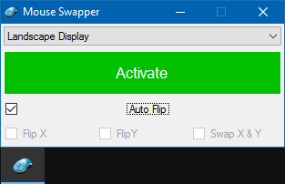

# MouseSwapper
.NET Based App for Switching Mouse Gesture in Windows

This small software is used to rotate/swap mouse direction, or even sync them to make them still properly work on rotated screen environment. Usually, mouse movement directionis unrotated while the screen does it. This tool can fix them and it is perfect for laptops with using rotated display.. while keeping the mouse works like when the screen is unrotated.

**[Download Portable EXE file](https://github.com/WelloSoft/MouseSwapper/raw/master/Build/MouseSwapper.exe)**

See the [documentation](https://github.com/WelloSoft/MouseSwapper/wiki) for proper details about usage of the App.
